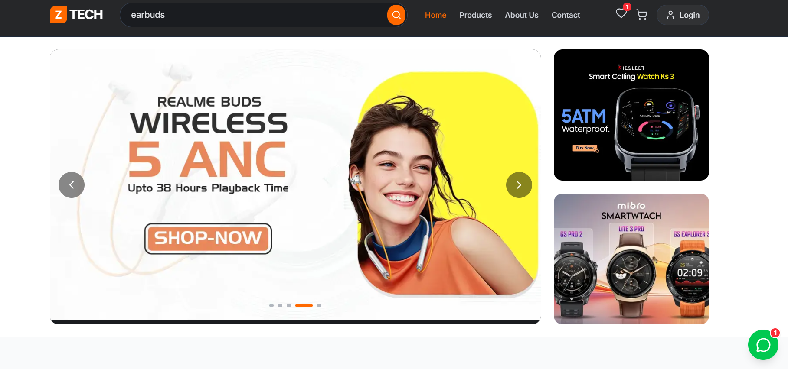
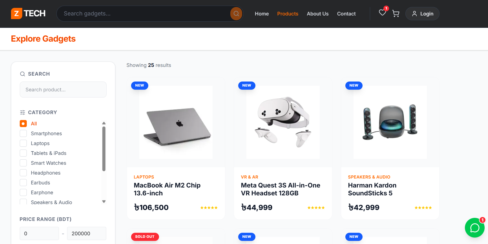
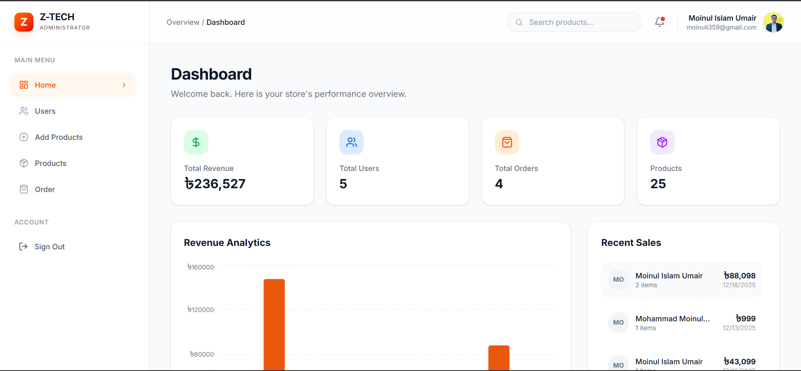

# Z-TECH Frontend

Z-TECH Frontend is the official user interface for the Z-TECH e-commerce platform, specializing in electronic gadgets. This comprehensive frontend application delivers a seamless online shopping experience for customers, complete with product browsing, authentication, cart management, and secure checkout. It also integrates a robust administrative dashboard for efficient store management, including product, user, and order administration.

---

## 🏠 Hero Section



The hero section is the first impression of the Z-TECH platform. It highlights the brand identity, showcases featured gadgets, and sets a modern, tech-focused tone for users. The clean layout and high-quality visuals immediately communicate trust, performance, and innovation.

---

## 📸 Application Screenshots

### 🛍️ Products Page



The Products page displays the complete catalog of available electronic gadgets. Users can browse products with a clean grid layout, view prices, and quickly navigate to individual product details. The design is fully responsive and optimized for smooth exploration.

---

### 📦 Product Details Page


The Product Details page provides in-depth information about a selected gadget, including images, descriptions, pricing, and availability. Users can add items to their cart or wishlist directly from this page, ensuring a smooth and intuitive shopping experience.

---

### 🛠️ Admin Dashboard



The Admin Dashboard is a powerful control panel designed for administrators. From here, admins can manage products, users, and orders efficiently. It supports adding new products, updating existing ones, tracking orders, and managing user roles—all in a secure, role-protected environment.

---

## ✨ Features

* **Comprehensive Product Catalog**: Explore a wide range of electronic gadgets with detailed individual product pages.
* **User Authentication & Authorization**: Secure login, signup, and user profile management powered by Firebase, including role-based access for administrators.
* **Shopping Cart Functionality**: Add, remove, and manage items in your shopping cart with ease.
* **Wishlist Management**: Save your favorite products to a personalized wishlist for future reference.
* **Secure Checkout Process**: A streamlined and secure checkout flow featuring an integrated payment modal.
* **Admin Dashboard**: A powerful administrative interface for managing products (add, view, update), users, and orders.
* **Dynamic Routing**: Efficient navigation and individual views for products, orders, and other resources.
* **Interactive UI Elements**: Engaging user experience with carousels (Embla Carousel), dialogs, dropdown menus, and more.
* **Real-time Notifications**: Instant user feedback and alerts using Sonner toasts and SweetAlert2.
* **Advanced Data Fetching**: Efficient data retrieval and state management powered by Tanstack React Query and Axios.
* **Performance Optimization**: Leverages Next.js for SSR or SSG to enhance performance and SEO.
* **Image & Asset Management**: Integrated image handling and optimization using Next-Cloudinary.
* **Responsive & Modern Design**: A sleek, responsive UI built with Tailwind CSS and Radix UI components.
* **Reusable Logic**: Custom React hooks for authentication, secure API calls, and role checking.

---

## Installation

Follow these steps to get the Z-TECH Frontend up and running on your local machine.

### Prerequisites

*   Node.js (v18.x or higher recommended)
*   npm or Yarn

### Steps

1.  **Clone the repository:**

    ```bash
    git clone https://github.com/Umair505/Z-Tech-Frontend.git
    cd Z-Tech-Frontend
    ```

2.  **Install dependencies:**

    ```bash
    npm install
    # OR
    yarn install
    ```

3.  **Configure Environment Variables:**
    Create a `.env.local` file in the root directory of the project and add the following variables. These are essential for Firebase integration and connecting to your backend API.

    ```dotenv
    NEXT_PUBLIC_FIREBASE_API_KEY="YOUR_FIREBASE_API_KEY"
    NEXT_PUBLIC_FIREBASE_AUTH_DOMAIN="YOUR_FIREBASE_AUTH_DOMAIN"
    NEXT_PUBLIC_FIREBASE_PROJECT_ID="YOUR_FIREBASE_PROJECT_ID"
    NEXT_PUBLIC_FIREBASE_STORAGE_BUCKET="YOUR_FIREBASE_STORAGE_BUCKET"
    NEXT_PUBLIC_FIREBASE_MESSAGING_SENDER_ID="YOUR_FIREBASE_MESSAGING_SENDER_ID"
    NEXT_PUBLIC_FIREBASE_APP_ID="YOUR_FIREBASE_APP_ID"
    NEXT_PUBLIC_SERVER_URL="YOUR_BACKEND_API_URL" # e.g., https://api.z-tech.com
    ```
    Replace the placeholder values with your actual Firebase project credentials and your backend server URL.

4.  **Run the development server:**

    ```bash
    npm run dev
    # OR
    yarn dev
    ```

    The application will now be running and accessible in your web browser at `http://localhost:3000`.

## Usage

Once the development server is running, you can interact with the Z-TECH Frontend:

*   **Browse Products**: Navigate to the homepage (`/`) to discover featured items, new arrivals, and special offers. The full product catalog is available at `/products`.
*   **User Authentication**: Sign up for a new account at `/signup` or log in at `/login` to access personalized features like your shopping cart, wishlist, and profile.
*   **Shopping & Checkout**: Add desired products to your cart. Proceed to `/cart` to review and manage your selections, then complete your purchase through the secure checkout process at `/checkout`.
*   **Profile & Wishlist**: Manage your personal information and view your saved products on the `/profile` and `/wishlist` pages, respectively.
*   **Admin Dashboard**: If you have administrator privileges, access the dashboard at `/dashboard`. From here, you can:
    *   Add new products: `/dashboard/add-product`
    *   View and manage existing products: `/dashboard/products`
    *   Manage user accounts: `/dashboard/users`
    *   Process and track orders: `/dashboard/orders` (individual order details at `/dashboard/orders/[id]`)

## Tech Stack

The Z-TECH Frontend is built using a modern and robust set of technologies:

*   **Framework**: Next.js (v16.0.7)
*   **UI Library**: React.js (v19.2.0)
*   **Styling**: Tailwind CSS, Radix UI (for headless components)
*   **Authentication & Backend Services**: Firebase
*   **State Management & Data Fetching**: Tanstack React Query, Axios
*   **UI Components**: Shadcn UI principles, Embla Carousel
*   **Notifications**: Sonner, SweetAlert2
*   **Image Handling**: Next-Cloudinary

### Dependencies

*   `@radix-ui/react-avatar`
*   `@radix-ui/react-dialog`
*   `@radix-ui/react-dropdown-menu`
*   `@radix-ui/react-label`
*   `@radix-ui/react-select`
*   `@radix-ui/react-slot`
*   `@tanstack/react-query`
*   `axios`
*   `class-variance-authority`
*   `clsx`
*   `date-fns`
*   `embla-carousel-autoplay`
*   `embla-carousel-react`
*   `firebase`
*   `framer-motion`
*   `lucide-react`
*   `next`
*   `next-cloudinary`
*   `next-themes`
*   `react`
*   `react-dom`
*   `react-hook-form`
*   `react-hot-toast`
*   `react-router`
*   `react-to-print`
*   `recharts`
*   `sonner`
*   `sweetalert2`
*   `tailwind-merge`

### Development Dependencies

*   `@tailwindcss/postcss`
*   `babel-plugin-react-compiler`
*   `eslint`
*   `eslint-config-next`
*   `tailwindcss`
*   `tw-animate-css`

## Project Structure

The project follows a well-organized structure, typical for Next.js applications using the App Router:

```
.
├── public/                     # Static assets like images, favicons, etc.
├── src/                        # Main source code directory
│   ├── app/                    # Next.js App Router for pages and layouts
│   │   ├── (root)/             # Public-facing application routes
│   │   │   ├── checkout/       # Checkout page
│   │   │   ├── login/          # Login page
│   │   │   ├── products/       # Product listing and detail pages
│   │   │   ├── profile/        # User profile page
│   │   │   ├── signup/         # Signup page
│   │   │   ├── wishlist/       # User wishlist page
│   │   │   └── ...             # Other public pages (about, contact, cart)
│   │   ├── dashboard/          # Admin dashboard routes
│   │   │   ├── add-product/    # Page to add new products
│   │   │   ├── orders/         # Order management pages
│   │   │   ├── products/       # Product management pages
│   │   │   └── users/          # User management pages
│   │   ├── globals.css         # Global Tailwind CSS styles
│   │   ├── layout.js           # Root layout with global providers (Auth, Query)
│   │   └── not-found.jsx       # Custom 404 page
│   ├── components/             # Reusable UI components
│   │   ├── auth/               # Authentication-specific components (e.g., AdminRoute)
│   │   ├── cards/              # Generic card components (e.g., ProductCard)
│   │   ├── checkout/           # Components specific to the checkout process (e.g., PaymentModal)
│   │   ├── home/               # Components for the homepage sections (Hero, New Arrivals)
│   │   ├── shared/             # Layout components (Navbar, Footer, SearchBar, CartDrawer)
│   │   └── ui/                 # Shadcn-style UI components (buttons, inputs, dialogs, etc.)
│   ├── hooks/                  # Custom React hooks for reusable logic (e.g., useAuth)
│   ├── lib/                    # Utility functions and core configurations
│   │   └── firebase/           # Firebase initialization
│   ├── providers/              # React Context Providers (AuthProvider, QueryProvider)
│   └── firebase/               # Firebase configuration (may overlap with lib/firebase)
├── components.json             # Shadcn UI configuration file
├── jsconfig.json               # JavaScript project configuration
├── next.config.mjs             # Next.js configuration file
├── package.json                # Project metadata and dependencies
├── postcss.config.mjs          # PostCSS configuration for Tailwind CSS
└── README.md                   # Project README file
```

## Contributing

We welcome contributions to the Z-TECH Frontend! If you'd like to contribute, please follow these general guidelines:

1.  **Fork the repository**.
2.  **Create a new branch** for your feature or bug fix: `git checkout -b feature/your-feature-name`.
3.  **Implement your changes**, ensuring they adhere to the existing coding style.
4.  **Write clear and concise commit messages**.
5.  **Push your branch** to your forked repository: `git push origin feature/your-feature-name`.
6.  **Open a Pull Request** to the `main` branch of this repository.

Please provide a detailed description of your changes in the pull request.

## License

This project is licensed under the MIT License.
